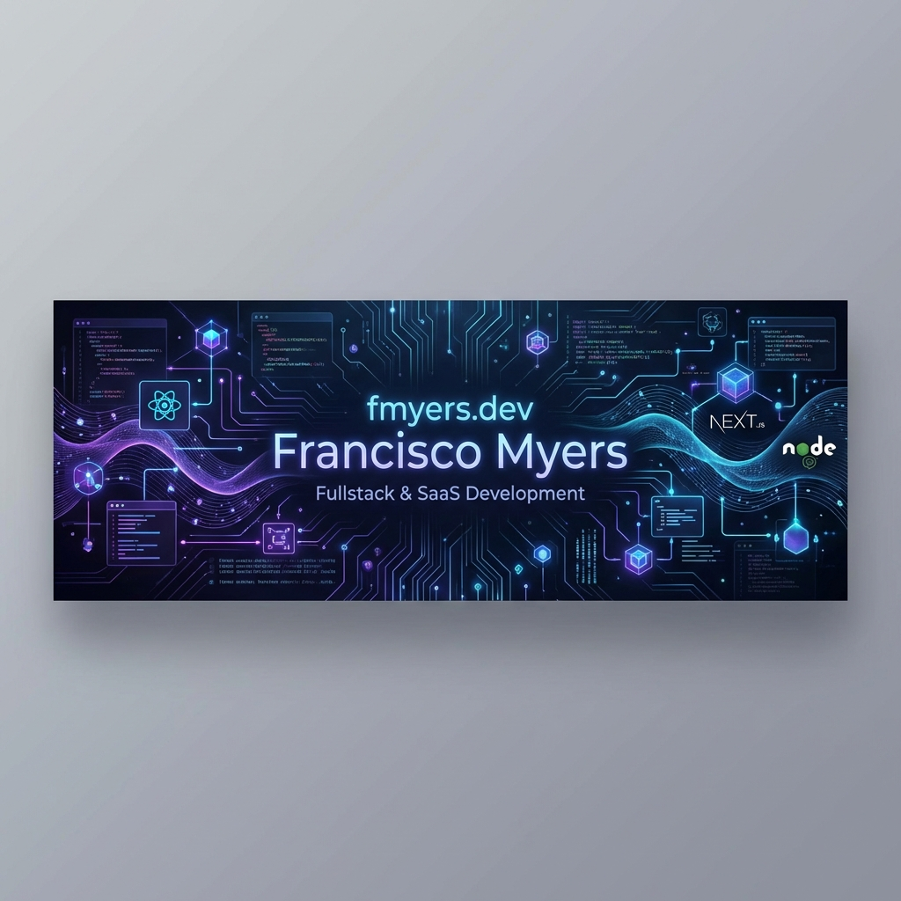
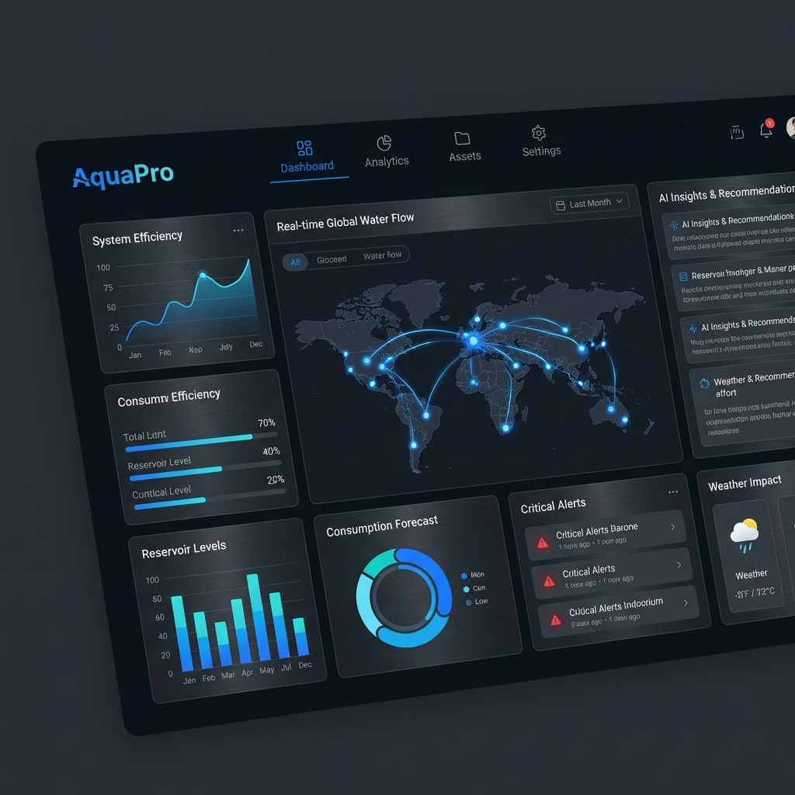
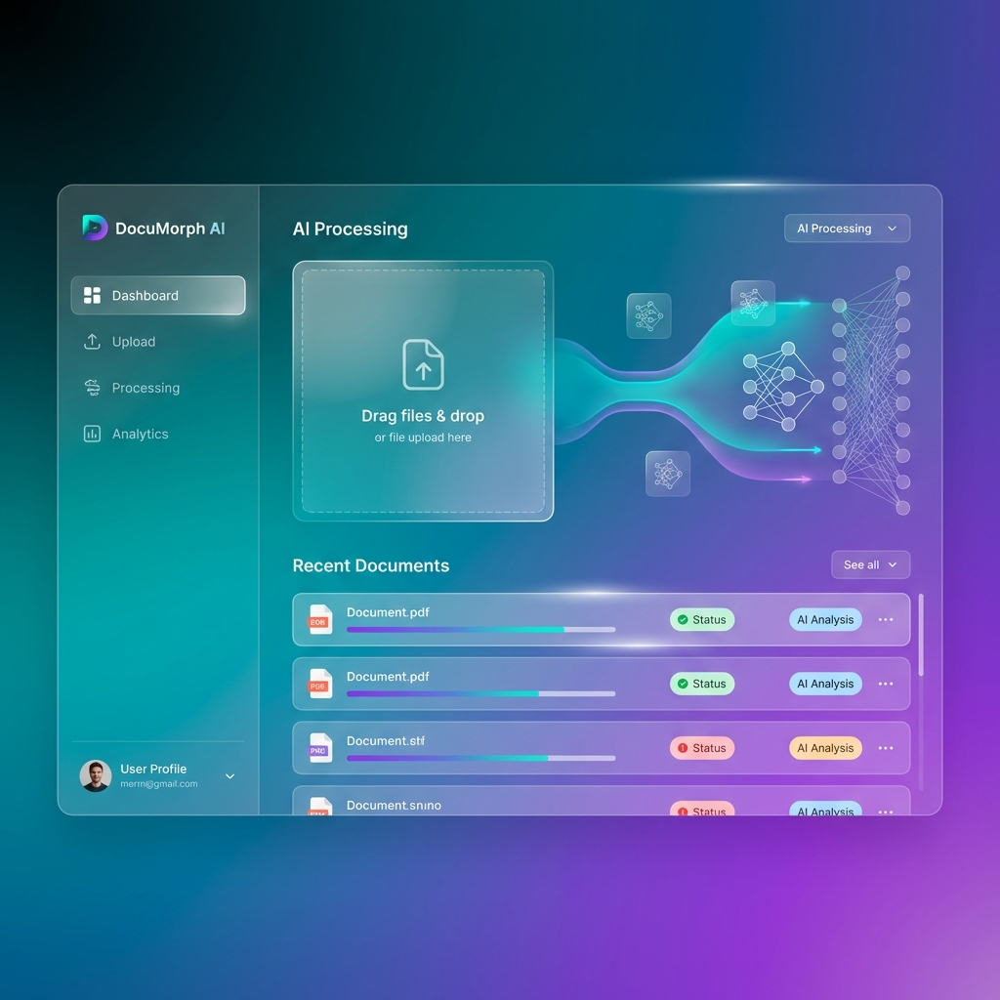
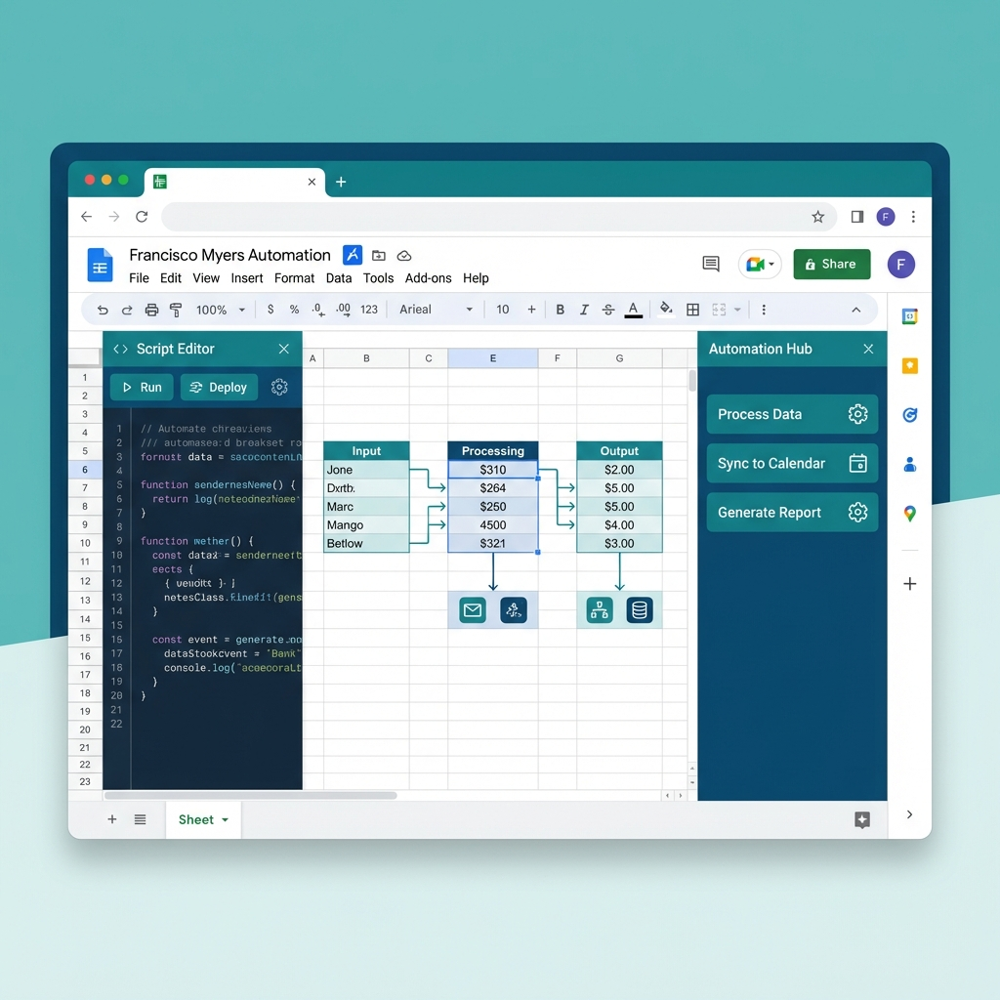
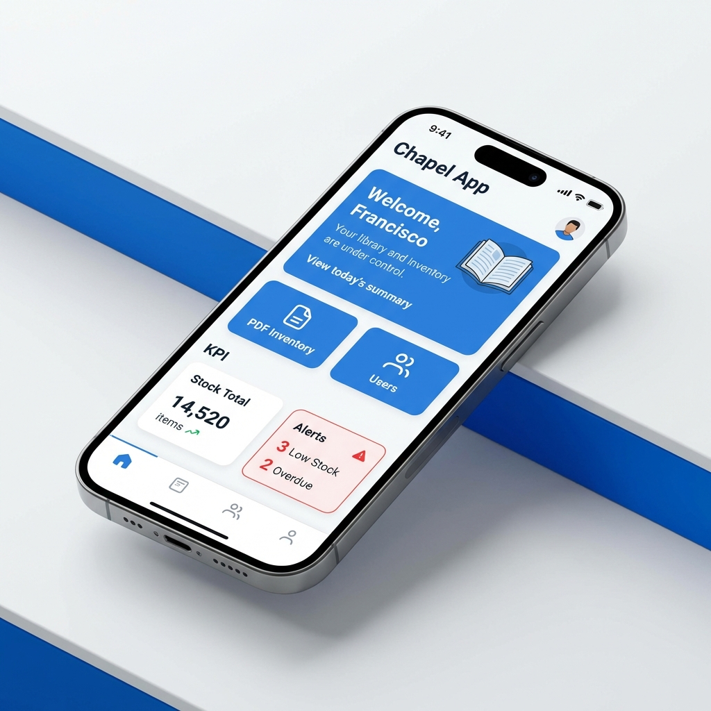

  

  # 🚀 Francisco Myers
  ### Fullstack Developer | SaaS Builder | Automation Architect

  
  
  

  ---

  *"Building scalable solutions, modern digital experiences, and powerful automations with a focus on SaaS and performance."*

## 📊 GitHub Insights

  
  

  

## 🛠️ Tech Stack & Skills

### 🎨 Frontend Development

- **Expertise:** Modern UI/UX, Responsive Design, State Management (Redux/Context), Performance Optimization.

### ⚙️ Backend & Infrastructure

- **Expertise:** REST & GraphQL APIs, Microservices Architecture, Database Modeling, Serverless Deployment.

### ⚡ Automation & Productivity

- **Expertise:** Google Workspace Automation, Custom Apps Script solutions, API Integrations, Workflow Optimization.

---

## 🏗️ Featured Impact & Projects

<table border="0">
  <tr>
    <td width="33%" valign="top">
       
      <b>🌊 AquaPro Dashboard</b> 
      High-performance water management system with real-time analytics. 
      
      
      
    </td>
    <td width="33%" valign="top">
       
      <b>📄 DocuMorph AI</b> 
      Intelligent document processing platform leveraging AI (Gemini API). 
      
      
      
    </td>
    <td width="33%" valign="top">
       
      <b>⛪ Chapel App Appscript</b> 
      Robust automation suite for Google Workspace and data management. 
      
      
      
    </td>
  </tr>
</table>

## 📱 App in Action (Mobile Experience)

  
  
<i>Premium mobile experience for Chapel App: Seamless inventory management on the go.</i>

## 🤝 Connect with Me

  
  
  

---

  

