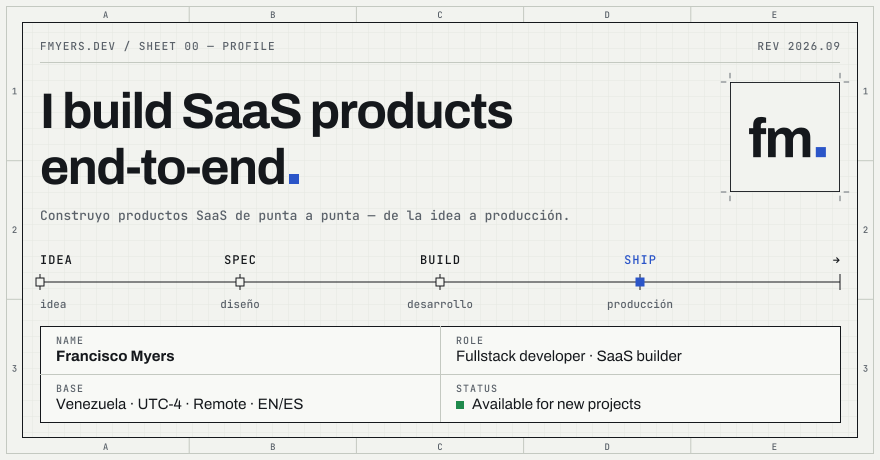
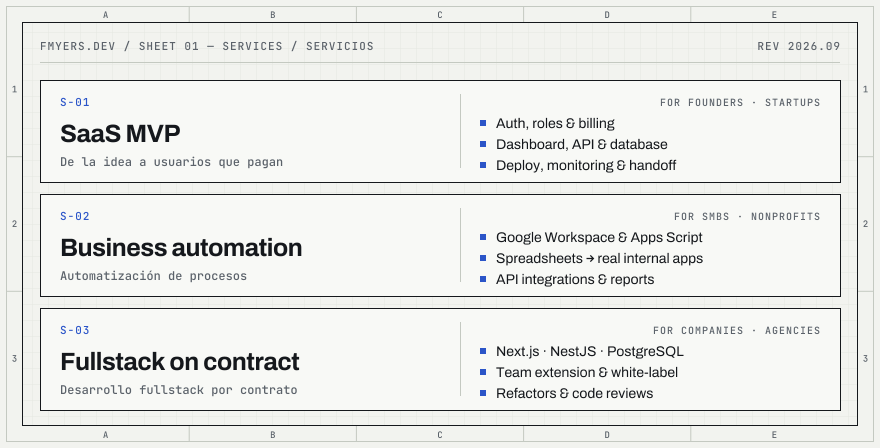
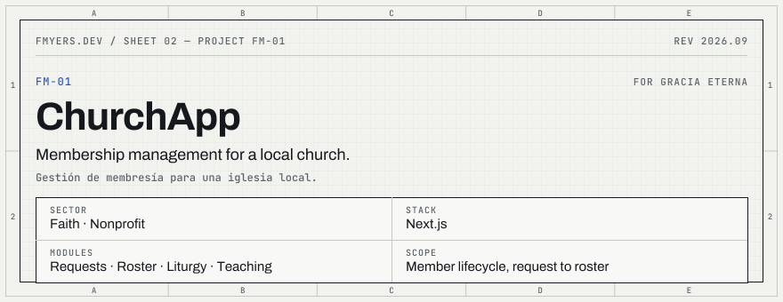
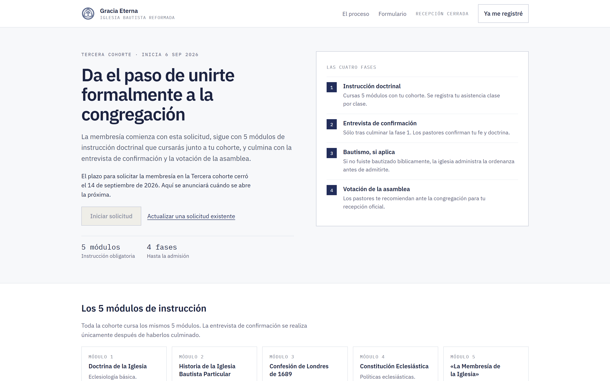
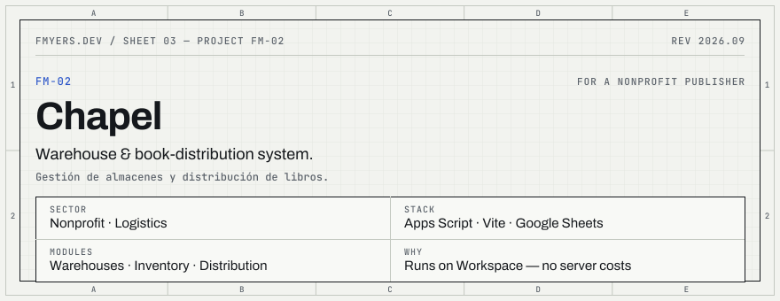
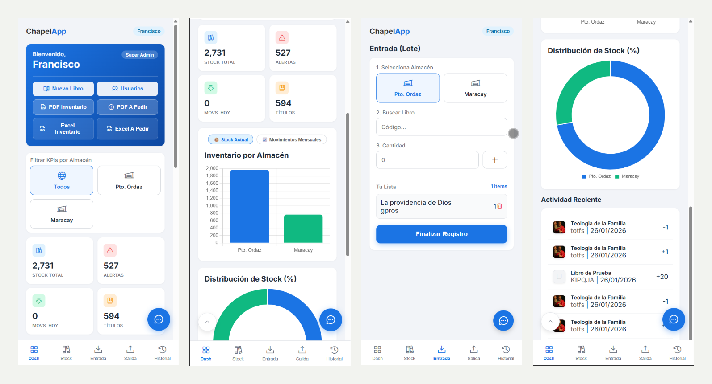
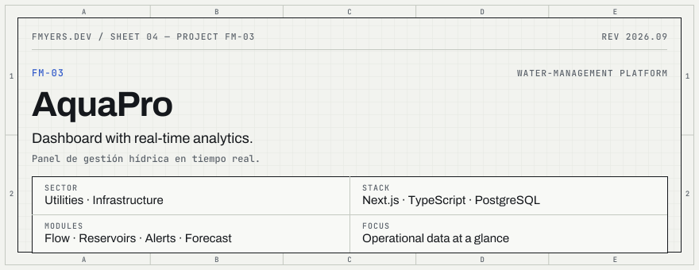
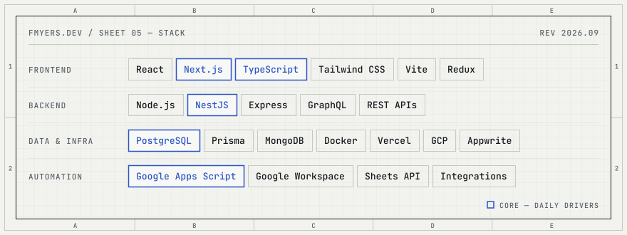
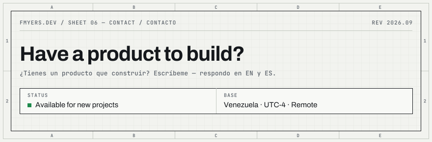
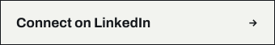

<picture>
  <source media="(prefers-color-scheme: dark)" srcset="assets/banner-dark.svg">
  
</picture>

**Francisco Myers** — Fullstack developer building SaaS products end-to-end with Next.js, NestJS, PostgreSQL and Google Workspace automation. 
Desarrollador fullstack. Construyo productos SaaS de punta a punta, de la idea a producción.

[WhatsApp](https://wa.me/584249080683) · [LinkedIn](https://linkedin.com/in/franciscomyers) · [Email](mailto:franciscomyers@gmail.com)

## Services · Servicios

<picture>
  <source media="(prefers-color-scheme: dark)" srcset="assets/services-dark.svg">
  
</picture>

## Selected work · Proyectos

<picture>
  <source media="(prefers-color-scheme: dark)" srcset="assets/project-churchapp-dark.svg">
  
</picture>
<!-- Screenshot:  -->

<picture>
  <source media="(prefers-color-scheme: dark)" srcset="assets/project-chapel-dark.svg">
  
</picture>
<!-- Screenshot:  -->

<picture>
  <source media="(prefers-color-scheme: dark)" srcset="assets/project-aquapro-dark.svg">
  
</picture>
<!-- Screenshot:  -->

## Stack

<picture>
  <source media="(prefers-color-scheme: dark)" srcset="assets/stack-dark.svg">
  
</picture>

## GitHub activity

<picture>
  <source media="(prefers-color-scheme: dark)" srcset="https://github-readme-stats.vercel.app/api?username=Solideomyers&show_icons=true&count_private=true&include_all_commits=true&hide_title=true&bg_color=0E1114&title_color=E9EBE6&text_color=98A0A8&icon_color=86A4F2&border_color=353C44&border_radius=0">
  
</picture>
<picture>
  <source media="(prefers-color-scheme: dark)" srcset="https://github-readme-stats.vercel.app/api/top-langs/?username=Solideomyers&layout=compact&hide=html,css&hide_title=true&bg_color=0E1114&title_color=E9EBE6&text_color=98A0A8&icon_color=86A4F2&border_color=353C44&border_radius=0">
  
</picture>

## Contact · Contacto

<picture>
  <source media="(prefers-color-scheme: dark)" srcset="assets/contact-dark.svg">
  
</picture>

  <a href="https://wa.me/584249080683"><picture>  <source media="(prefers-color-scheme: dark)" srcset="assets/btn-whatsapp-dark.svg">  </picture></a>
  <a href="https://linkedin.com/in/franciscomyers"><picture>  <source media="(prefers-color-scheme: dark)" srcset="assets/btn-linkedin-dark.svg">  </picture></a>

fmyers.dev · Rev 2026.09

