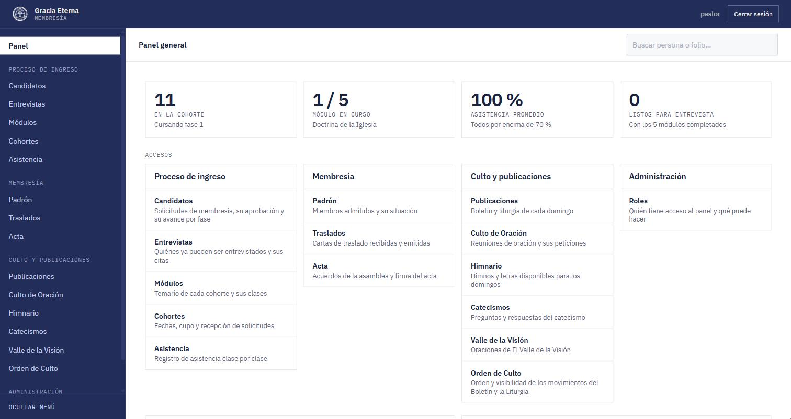

# FM-01 · ChurchApp
Local church · Faith / Nonprofit · First public release in 10 days, ongoing · Design, fullstack and deployment — <i>Iglesia local · Fe / Sin fines de lucro · Primera versión pública en 10 días, en curso · Diseño, fullstack y despliegue</i>

| SECTOR | MODULES | STACK | STATUS |
|---|---|---|---|
| Faith · Nonprofit | Applications · Cohorts · Attendance · Interviews · Member roll · Minutes · Sunday publications | Next.js · TypeScript · Supabase (Postgres, RLS, Auth) · Vercel | Live · v1.2.0 |

## Context · Contexto
Gracia Eterna is a Reformed Baptist church. Becoming a member takes four phases: a formal application, five modules of doctrinal instruction taken with a cohort, a confirmation interview with the pastors, and a vote of the congregational assembly.

## Problem · Problema
The church needed one place to run that whole process: take applications, record attendance class by class, approve modules, schedule interviews and keep the member roll. It also needed a way for each applicant to see where their file stood without asking the office.

## Constraints · Restricciones
- The pastoral team works from their phones, and the member roll and bulletins are photocopied in black and white. Status is shown with letter codes and borders, never with background colour alone.
- Production holds real personal data. Development runs on a separate database, and only a release touches production.
- Staff access is by invitation only. There is no public sign-up.

## Solution · Solución
- **Public page:** explains membership and its four phases and takes the application with the applicant's testimony. The applicant receives a folio number by email and can check their progress with folio and ID at any time, with no password.
- **Staff panel:** candidates, cohorts, attendance per class taken from the phone, module approval one by one (reversible), confirmation interviews, member roll, transfers, assembly minutes and hymnal.
- **Sunday publications:** bulletin, mobile bulletin, liturgy and prayer service, with an order of worship the office configures without touching code.
- **Roles:** Pastor, Secretary, Teacher, Treasury, Audiovisual and Administrator. Google sign-in works only for accounts that were already invited.
- **Key decision:** no custom server. The client talks to Supabase directly, row-level security guards every table, and sensitive logic lives in database functions and Edge Functions.

## Outcome · Resultado
- Public v1.0.0 shipped 10 days after the first commit (Aug 25 → Sep 4, 2026). v1.1.0 followed on Sep 9 and v1.2.0 on Sep 24.
- The third cohort runs on the panel: 11 candidates in phase 1 with 100% average attendance (Sep 2026).

## Screens · Pantallas

---
Want something similar? [WhatsApp](https://wa.me/584249080683) · [LinkedIn](https://linkedin.com/in/franciscomyers)
